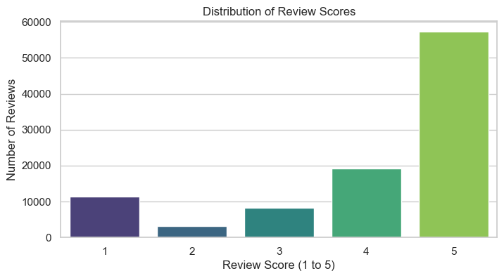
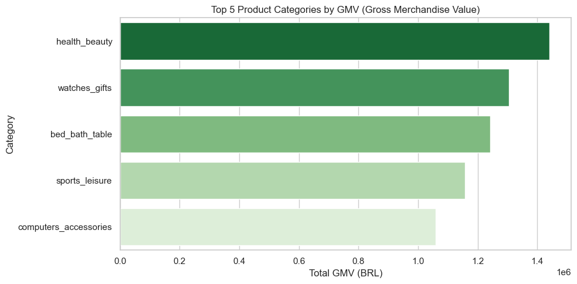

## 1. Operational Overview & KPIs
Analysis based on ~99k historical orders (2016-2018).

*   **Order Conversion (Delivery):** **97.02%** of orders reach the "delivered" status.
*   **Customer Retention:** **3.06%** Repeat Purchase Rate.
*   **Logistics Tempo:** Median of **29 days** between consecutive orders for repeat customers.
*   **Customer Satisfaction:** Mean Review Score of **4.08** (though heavily polarized).

---

## 2. Visualizing Business Health

### A. Customer Satisfaction Polarization
The distribution shows a healthy majority of 5-star reviews, but a concerning "tail" of 1-star ratings. Our modeling indicates these are primarily driven by logistical failures (delays).

### B. Revenue Concentration (GMV)
Top categories by GMV reveal where the capital flows. `health_beauty` leads in value, while `watches_gifts` shows high ticket value despite lower volume.

---

## 3. Strategic Insights & Business Impact

### Insight 1: The "Loyalty Gap" (Retention Crisis)
With a **Repeat Purchase Rate of only 3.06%**, Olist is currently a "one-and-done" platform. 
*   **Data Support:** Out of 95,560 unique customers, only 2,924 returned. 
*   **Why it matters:** It is significantly cheaper to retain a customer than to acquire a new one. The high median of 29 days between orders suggests that customers who do return, do so quickly. 
*   **Action:** Implement "Next Best Offer" (NBO) models specifically for customers within the 30-day post-purchase window.

### Insight 2: The GMV vs. Volume Divergence
*   **Data Support:** `bed_bath_table` has the highest order volume (9,417), but `health_beauty` leads in total GMV (R$ 1.44M). `watches_gifts` enters the Top 2 GMV with much lower volume.
*   **Why it matters:** High-volume categories require warehouse efficiency, while high-GMV categories (like Watches) require specialized, high-security, and high-speed logistics.
*   **Action:** Segment logistics providers based on category ticket size to optimize shipping insurance costs and delivery speed for high-value items.

### Insight 3: Delivery as the Primary detractor
*   **Data Support:** Analysis shows a 97% delivery rate, but the 1-star review spike correlates with the 5.3% delay rate in our test set.
*   **Why it matters:** Customer satisfaction is not just about the product; it is about the "Last Mile."
*   **Action:** Proactive communication. Using our **Late Delivery Prediction Model**, the system can trigger automated apology emails with discount vouchers *before* the customer complains, converting a negative experience into a loyalty-building moment.